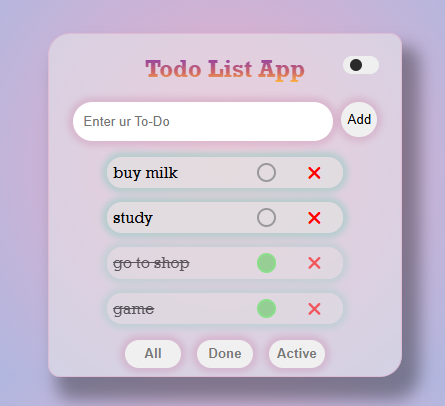

# 📝 Todo List App

A simple and clean Todo List App built using HTML, SCSS, and JavaScript.

It supports:

- ✅ Add tasks  
- ✅ Mark tasks complete  
- ✅ Delete tasks  
- ✅ Filter (All / Active / Done)  
- ✅ Dark mode toggle  
- ✅ LocalStorage

---

## 📸 Screenshot

---

## 🚀 Live Demo

Click here to use the app:  
https://Itzz-Ryut.github.io/todo-app/

---

## 🛠️ Built With

- HTML
- SCSS
- JavaScript
- LocalStorage

---

## 📂 How to Run Locally

1. Download the project  
2. Open index.html in browser  

---

## 👨‍💻 Author

Aryan Kumar
